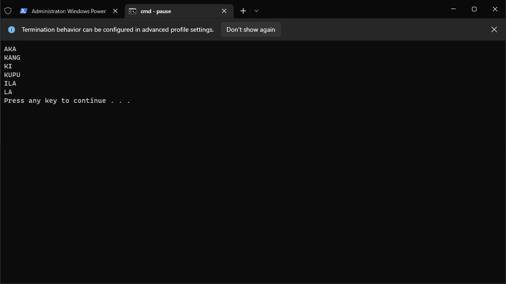
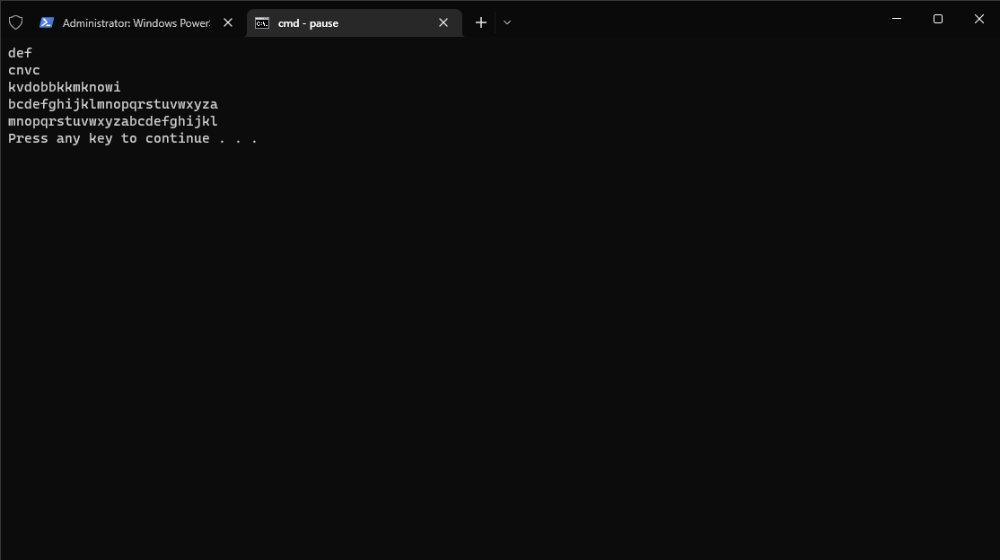
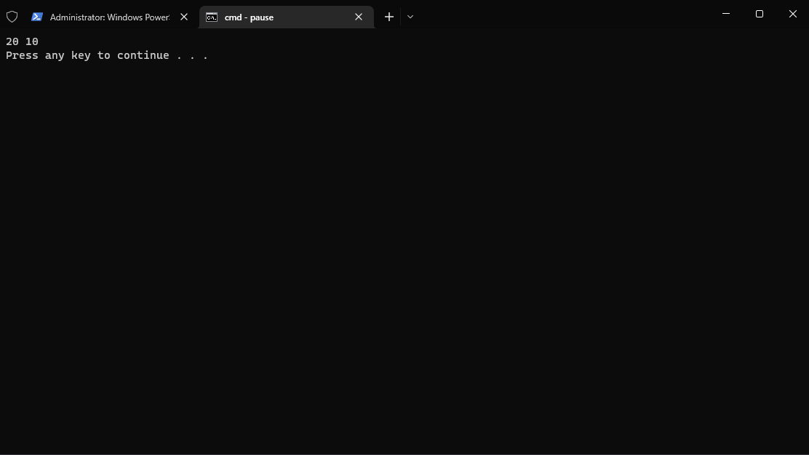
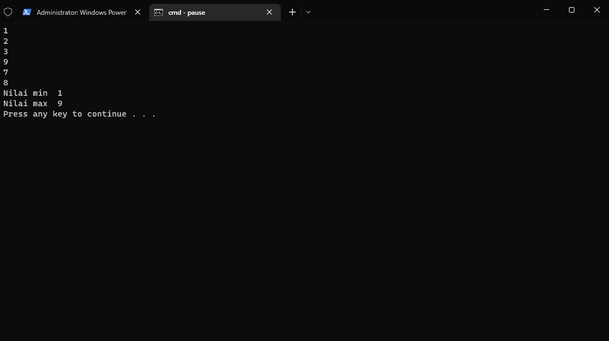
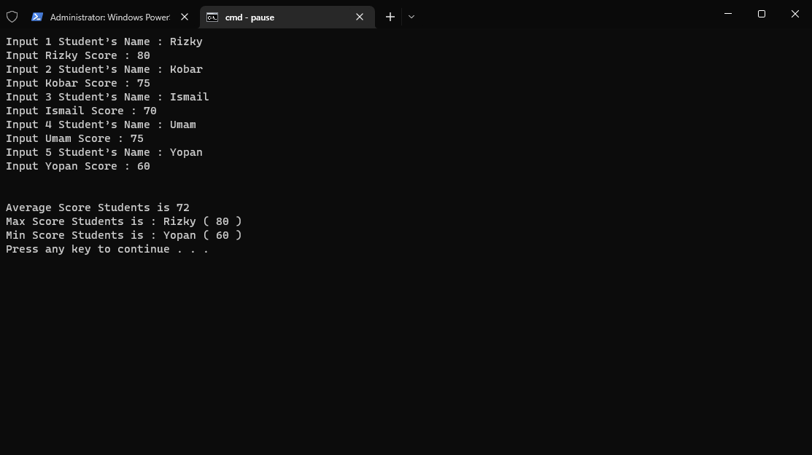
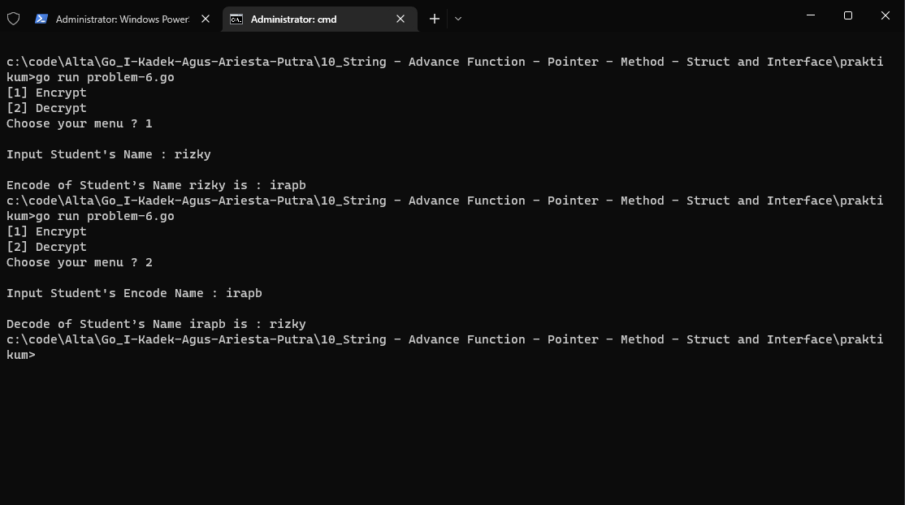

# PRAKTIKUM

Diberikan soal praktikum berikut : https://docs.google.com/document/d/132qq8KrPFEsO-N2Zh3KyTsnysqJgRch9WOKQBTuF8dI/mobilebasic

## Problem-1 | Compare String

Solusi : [problem-1.go](problem-1.go)
Output :

## Problem-2 | Caesar Cipher

Solusi : [problem-2.go](problem-2.go)
Output :

## Problem-3 | Swap Two Number Using Pointer

Solusi : [problem-3.go](problem-3.go)
Output :

## Problem-4 | Min and Max Using Pointer

Solusi : [problem-4.go](problem-4.go)
Output :

## Problem-5 | Students Score

Solusi : [problem-5.go](problem-5.go)
Output :

## Problem-6 | Substitution Cipher

Solusi : [problem-6.go](problem-6.go)
Output :
