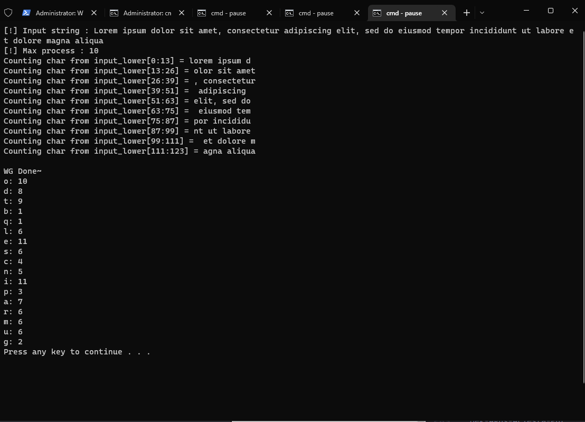
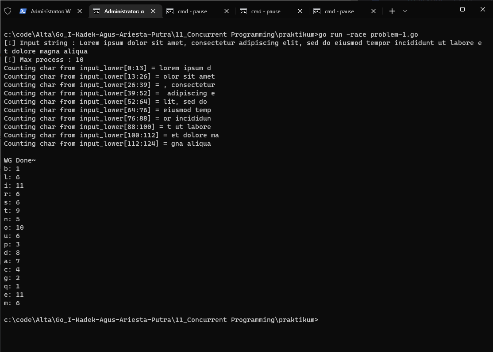

# PRAKTIKUM

Diberikan soal praktikum berikut : https://docs.google.com/document/d/11xmQIijbxQsf2CKuCQlvO5qSLW_4bS1hiLv5qa6XXZo/mobilebasic

## Problem-1 | Letter Frequency

Menghitung frekuensi huruf dalam teks menggunakan perhitungan paralel (Bersamaan).

Solusi : [problem-1.go](problem-1.go)
Output :

Telah dilakukan debug race condition dan hasilnya tidak ditemukan race condition

