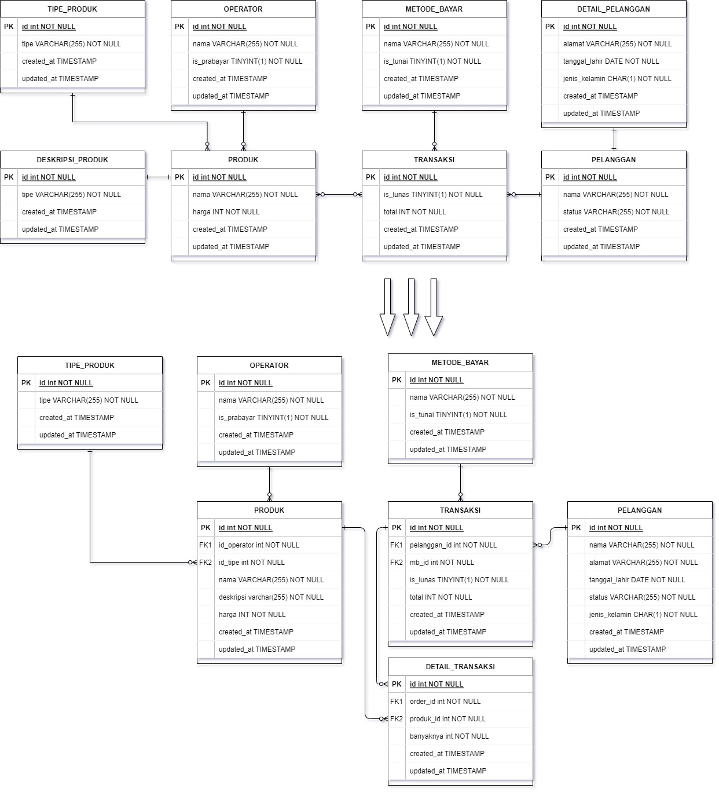
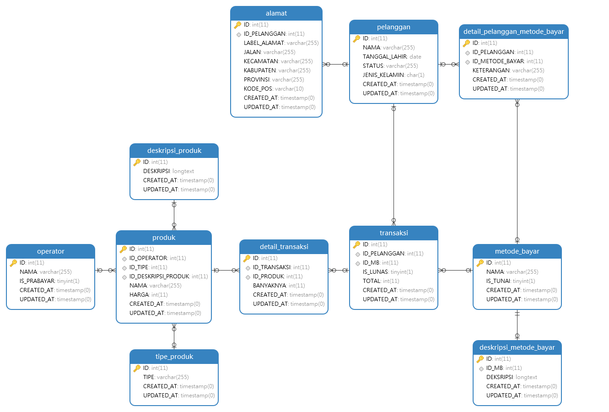

# PRAKTIKUM

Diberikan praktikum sebagai berikut: https://docs.google.com/document/d/1Bj01GxW4-xHNFGBKkmQ6lWis_c8_E0h9a5yyaSHf96I/edit#

## 1. PART 1 - Schema Database

### Learning Competencies
- Mengerti bentuk-bentuk relasi skema database dasar
- Mampu memodelkan relasi skema dasar
- Mampu mengimplementasikan 1-to-1, 1-to-many, many-to-many

### Summary
Setelah mempelajari cara mendesain database, kita akan mencoba untuk memodelkan skema dan relasinya berdasarkan kasus di dunia nyata. Kita akan mencoba menganalisa suatu kasus dan menentukan skema serta relasi yang dibutuhkan.

### Releases
### Release 0 : Implement the Schema (Digital Outlet Pulsa)

1. Sistem dapat menyimpan data mengenai detail item product, yaitu : product, product_type, product_description, operator, payment_methods
2. Sistem juga harus menyimpan data mengenai pelanggan yang akan membeli product tsb diantaranya : nama, alamat, tanggal lahir, status_user, gender, created_at, updated_at
3. Sistem dapat mencatat transaksi pembelian dari pelanggan.
4. Sistem dapat mencatat detail transaksi pembelian dari pelanggan.
5. Gunakan draw.io atau lucidchart untuk membuat ERD.

### Jawaban:


Untuk memenuhi 1-to-1, 1-to-many, dan many-to-many terdapat pada diagram di atas. Kemudian setelah dinormalisasi diagram menjadi yang di bawah.

## 2. PART 1 - Data Definition Language

### Learning Competencies
- Mampu untuk menggunakan statement SQL DDL
- Mampu menggunakan MySQL di Terminal untuk query data

### Summary
Silakan mempelajari terlebih dahulu lebih lanjut mengenai SQL dan MySQL. Sekarang kamu akan mengimplementasikan schema yang kamu buat menjadi tabel di MySQL, memasukkan data ke tabel dan melakukan pengambilan data pada tabel-tabel yang ada.

### Releases dan Jawaban

Full query ada pada [release-1.sql](release-1.sql)

1. Create database alta_online_shop.
```sql
CREATE DATABASE alta_online_shop;
```
2. Dari schema Olshop yang telah kamu kerjakan di, Implementasikanlah menjadi table pada MySQL.
- a. Create table user
```sql
CREATE TABLE PELANGGAN(
    ID INT PRIMARY KEY,
    NAMA VARCHAR(255) NOT NULL,
    ALAMAT VARCHAR(255) NOT NULL,
    TANGGAL_LAHIR DATE NOT NULL,
    STATUS VARCHAR(255) NOT NULL,
    JENIS_KELAMIN CHAR(1) NOT NULL,
    CREATED_AT TIMESTAMP,
    UPDATED_AT TIMESTAMP
);
```
- b. Create table product, product type, operators, product description, payment_method.
```sql
# BUAT TIPE_PRODUK
CREATE TABLE TIPE_PRODUK ( 
	ID INT PRIMARY KEY, 
	TIPE VARCHAR(255) NOT NULL,
	CREATED_AT TIMESTAMP,
	UPDATED_AT TIMESTAMP
)

# BUAT OPERATOR
CREATE TABLE OPERATOR ( 
	ID INT PRIMARY KEY,
	NAMA VARCHAR(255) NOT NULL,
	IS_PRABAYAR TINYINT(1) NOT NULL,
	CREATED_AT TIMESTAMP,
	UPDATED_AT TIMESTAMP
)

# BUAT DESKRIPSI PRODUK
CREATE TABLE DESKRIPSI_PRODUK ( 
	ID INT PRIMARY KEY,
	DESKRIPSI LONGTEXT NOT NULL,
	CREATED_AT TIMESTAMP,
	UPDATED_AT TIMESTAMP
)

# BUAT TABEL PRODUK DAN SEKALIAN FK-NYA
CREATE TABLE PRODUK ( 
	ID INT PRIMARY KEY,
	ID_OPERATOR INT,
	ID_TIPE INT,
	ID_DESKRIPSI_PRODUK INT,
	NAMA VARCHAR(255) NOT NULL,
	HARGA INT NOT NULL, 
	CREATED_AT TIMESTAMP,
	UPDATED_AT TIMESTAMP,
	CONSTRAINT FK_TIPE_P FOREIGN KEY (ID_TIPE) REFERENCES TIPE_PRODUK(ID), 
	CONSTRAINT FK_OPERATOR_P FOREIGN KEY (ID_OPERATOR) REFERENCES OPERATOR(ID), 
	CONSTRAINT FK_DESKRIPSI_P FOREIGN KEY (ID_DESKRIPSI_PRODUK) REFERENCES DESKRIPSI_PRODUK(ID)
)

# BUAT TABEL PAYMENT METHOD
CREATE TABLE METODE_BAYAR ( 
	ID INT PRIMARY KEY,
	NAMA VARCHAR(255) NOT NULL,
	IS_TUNAI TINYINT(1) NOT NULL,
	CREATED_AT TIMESTAMP,
	UPDATED_AT TIMESTAMP
)
```
- c. Create table transaction, transaction detail.
```sql
# BUAT TABEL TRANSAKSI
CREATE TABLE TRANSAKSI ( 
	ID INT PRIMARY KEY,
	ID_PELANGGAN INT,
	ID_MB INT,
	IS_LUNAS TINYINT(1) NOT NULL,
	TOTAL INT NOT NULL, 
	CREATED_AT TIMESTAMP,
	UPDATED_AT TIMESTAMP,
	CONSTRAINT FK_PELANGGAN_T FOREIGN KEY (ID_PELANGGAN) REFERENCES PELANGGAN(ID), 
	CONSTRAINT FK_METODEBAYAR_T FOREIGN KEY (ID_MB) REFERENCES METODE_BAYAR(ID)
);

# BUAT TABEL DETAIL_TRANSAKSI
CREATE TABLE DETAIL_TRANSAKSI ( 
	ID INT PRIMARY KEY,
	ID_TRANSAKSI INT,
	ID_PRODUK INT,
	BANYAKNYA INT NOT NULL, 
	CREATED_AT TIMESTAMP,
	UPDATED_AT TIMESTAMP,
	CONSTRAINT FK_PRODUK_DT FOREIGN KEY (ID_PRODUK) REFERENCES PRODUK(ID), 
	CONSTRAINT FK_TRANSAKSI_DT FOREIGN KEY (ID_TRANSAKSI) REFERENCES TRANSAKSI(ID)
);
```
3. Create tabel kurir dengan field id, name, created_at, updated_at.
```sql
# BUAT TABEL KURIR
CREATE TABLE KURIR ( 
	ID INT PRIMARY KEY,
	NAMA VARCHAR(255) NOT NULL,
	CREATED_AT TIMESTAMP,
	UPDATED_AT TIMESTAMP
)
```
4. Tambahkan ongkos_dasar column di tabel kurir.
```sql
# TAMBAHKAN ONGKOS_DASAR PADA KURIR
ALTER TABLE KURIR 
ADD ( 
    ONGKOS_DASAR INT
);
```
5. Rename tabel kurir menjadi shipping.
```sql
# GANTI KURIR MENJADI SHIPPING
ALTER TABLE KURIR RENAME TO SHIPPING;
```
6. Hapus / Drop tabel shipping karena ternyata tidak dibutuhkan.
```sql
# HAPUS TABLE SHIPPING
DROP TABLE SHIPPING;
```

7. Silahkan menambahkan entity baru dengan relation 1-to-1, 1-to-many, many-to-many.

- a. 1-to-1: payment method description.
```sql
## 1. 1-to-1
# BUAT DEKSRIPSI METODE BAYAR
CREATE TABLE DESKRIPSI_METODE_BAYAR ( 
	ID INT PRIMARY KEY,
	ID_MB INT NOT NULL UNIQUE,
	DEKSRIPSI LONGTEXT NOT NULL,
	CREATED_AT TIMESTAMP,
	UPDATED_AT TIMESTAMP,
	CONSTRAINT FK_METODEBAYAR_DMB FOREIGN KEY (ID_MB) REFERENCES METODE_BAYAR(ID) 
);
```
- b. 1-to-many: user dengan alamat, misalnya user punya banyak alamat
```sql
## 2. 1-to-many
# HAPUS KOLOM ALAMAT PADA PELANGGAN
ALTER TABLE PELANGGAN DROP COLUMN ALAMAT;

# BUAT TABEL ALAMAT DAN HUBUNGKAN KE PELANGGAN
CREATE TABLE ALAMAT ( 
	ID INT PRIMARY KEY,
	ID_PELANGGAN INT,
	LABEL_ALAMAT VARCHAR(255) NOT NULL,
	JALAN VARCHAR(255) NOT NULL,
	KECAMATAN VARCHAR(255) NOT NULL,
	KABUPATEN VARCHAR(255) NOT NULL,
	PROVINSI VARCHAR(255) NOT NULL,
	KODE_POS VARCHAR(10) NOT NULL,
	CREATED_AT TIMESTAMP,
	UPDATED_AT TIMESTAMP,
	CONSTRAINT FK_PELANGGAN_A FOREIGN KEY (ID_PELANGGAN) REFERENCES PELANGGAN(ID)
);
```

- c. Many-to-many. Misalkan pelanggan dengan metode bayar memiliki DETAIL_PELANGGAN_METODE_BAYAR
```sql
## c. many-to-many. Misalkan user dengan metode bayar memiliki suer detail metode bayar
# BUAT TABEL DETAIL_PELANGGAN_METODE_BAYAR
CREATE TABLE DETAIL_PELANGGAN_METODE_BAYAR ( 
	ID INT PRIMARY KEY,
	ID_PELANGGAN INT,
	ID_METODE_BAYAR INT,
	KETERANGAN VARCHAR(255), 
	CREATED_AT TIMESTAMP,
	UPDATED_AT TIMESTAMP,
	CONSTRAINT FK_PELANGGAN_DPMT FOREIGN KEY (ID_PELANGGAN) REFERENCES PELANGGAN(ID), 
	CONSTRAINT FK_METODEBAYAR_DPMT FOREIGN KEY (ID_METODE_BAYAR) REFERENCES METODE_BAYAR(ID)
);
```

Sehingga diagramnya menjadi sebagai berikut:
