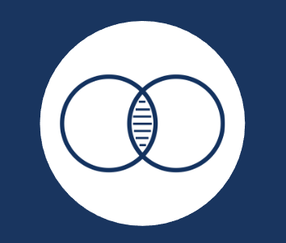
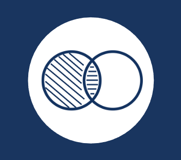

# SUMMARY

## 1. Join dan Union

### JOIN
JOIN merupakan sebuah klausa untuk melakukan kombinasi record dari dua atau lebih tabel. Terdapat 3 macam join yang dibahas di ppt tersebut sebagai berikut:

1. Inner Join

Inner join merupakan penggabungan yang cukup umum digunakan, dimana pada join ini SQL hanya akan mengambil data yang beririsan saja untuk masing-masing tabel. Sementara untuk data yang tidak sama untuk kedua tabel akan diabaikan. Contohnya sebagai berikut:

```sql
SELECT t.message from user u
INNER JOIN tweets t
ON u.id = t.user_id;
```

2. Left Join

Left join akan mengembalikan seluruh baris dari tabel di sebelah kiri yang dikenal kondisi ON dan hanya baris dari tabel di sebelah kanan yang memenuhi kondisi join. Contohnya sebagai berikut:
```sql
SELECT u.username, t.message
FROM user u
LEFT JOIN tweets t
ON u.id = t.user_id;
```

3. Right Join

Right join akan mengembalikan semua baris dari tabel sebelah kanan yang dikenai kondisi ON dengan data dari tabel sebelah kiri yang memenuhi kondisi join. Teknik ini merupakan kebalikan dari left join. Contohnya sebagai berikut:
```sql
SELECT u.username, t.message
FROM user u
RIGHT JOIN tweets t
ON u.id = t.user_id;
```

### UNION
Fungsi UNION pada SQL digunakan untuk menggabungkan dua tabel dalam bentuk baris baru ke bawah dimana field yang di-SELECT antara tabel satu dan lainnya adalah harus sama. Atau sederhananya yaitu untuk menempatkan baris dari kueri satu sama lain dan nilainya distinct/unik. Contohnya

```sql
SELECT username, fullname
FROM users WHERE id=1
UNION
SELECT username, fullname
FROM users WHERE id=2
```

## 2. Agregasi dan Subquery

### Agregasi
Fungsi di mana nilai beberapa baris dikelompokkan bersama untuk membentuk nilai ringkasan tunggal. Fungsi agregasi SQL sebagai berikut:

#### MIN/MAX
Fungsi di mana nilai beberapa baris dikelompokkan bersama untuk membentuk nilai ringkasan tunggal terkecil/terbesar.

#### SUM
Digunakan untuk mendapatkan jumlah total nilai dari sebuah data atau record di tabel.

#### AVG
Digunakan untuk mencari rata-rata dari sebuah data di tabel.

#### COUNT
Digunakan untuk mencari jumlah dari sebuah data atau record di tabel.

#### HAVING
Digunakan untuk menyeleksi data berdasarkan kriteria tertentu, dimana kriteria berupa fungsi aggregat.

### SUBQUERY
Subquery atau Inner Query atau Nested Query adalah query di dalam query SQL lain. Subquery digunakan untuk mengembalikan data yang akan digunakan dalam query utama sebagai syarat untuk lebih membatasi data yang akan diambil.

Terdapat peraturan dalam menggunakan subquery sebagai berikut:

1. Harus tertutup dalam tanda kurung
2. Sebuah subquery hanya dapat memiliki satu kolom pada klausa SELCT, keculai beberapa kolom yang diquery utama untuk subquery untuk membandingkan kolom yang dipilih.
3. Subqueries yang kembali lebih dari satu baris hanya dapat digunakan dengan beberapa value operator seperti operator IN.
4. Daftar SELECT tidak bisa menyertakan referensi ke nilai-nilai yang mengevaluasi ke BLOB, ARRAY, CLOB, atau NCLOB.
5. Sebuah subquery tidak dapat segera tertutup dalam fungsi set.

Contoh Subquery:
```sql
SELECT *
FROM USERS
WHERE id IN (
    SELECT user_id FROM tweets GROUP BY user_id HAVING SUM(favourite_count) > 5
);
```

## 3. Function

Function merupakan sebuah kumpulan statement yang akan mengembalikan sebuah nilai balik pada pemanggilnya. Contohnya adalah sebagai berikut fungsi yang mengembalikan jumlah data dari tweets per user:

```sql
DELIMITER $$
CREATE FUNCTION sf_count_tweet_peruser(user_id_p int) RETURNS INT DETERMINISTIC
BEGIN
    DECLARE total INT;
    SELECT COUNT(*) INTO total FROM tweets
    WHERE user_id = user_id_p AND
    type='tweets';
    RETURN total;
END$$
DELIMITER;
```

Beberapa point penting:

- DELIMITER
    Memberitahu kepada mysql soal delimiter yagn digunakan, secara default menggunakan ; jadi bila ada tanda ; mysql akan mengartikan akhir dari statement, pada contoh di atas delimiter yang digunakan \$\$ jadi akhir statementnya adalah \$\$
- CREATE FUNCTION
    Adalah header untuk membuat function
- RETURN
    Adalah untuk menentukan tipe data yang akan direturn oleh fungsi
- DETERMINISTIC /NOT DETERMINISTIC
    Adalah untuk menentukan yang bisa menggunakan function ini adalah user pembuatnya saja (deterministic) atau semua user (not deterministic)
- BEGIN END
    Adalah body dari function, jadi semua statement SQL ditulis di dalam sini.