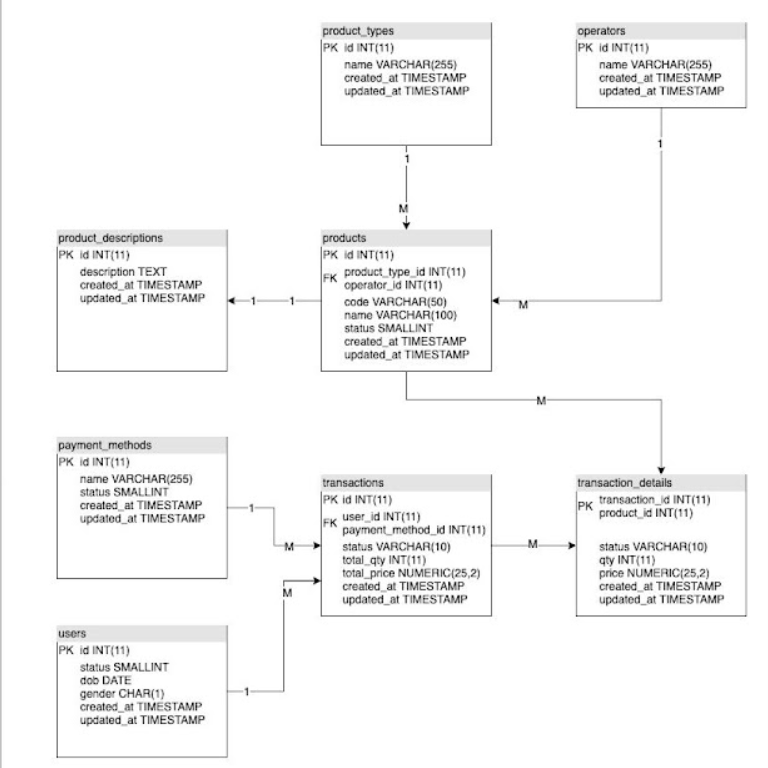

# PRAKTIKUM

Diberikan soal praktikum sebagai berikut: https://docs.google.com/document/d/1xCBvtDeh7eqDrIxw0ahBn0fWv5BGawnUdrh_HQPerXI/mobilebasic

## Jawaban

### Data Definition Language

Pada skema di soal, terdapat beberapa tabel yang aneh seperti tabel `users` tidak memiliki nama namun pada soal tiba-tiba diminta untuk menginsert nama, kemudian tabel `products` tidak memiliki harga sehingga kurang jelas referensi harga yang digunakan pada tabel `transaction_details`. Sehingga skema yang saya gunakan adalah sebagai berikut: 

Berikut merupakan SQL Query yang digunakan untuk membangun DB di atas, terdapat juga trigger untuk membuat auto-fill field UPDATED_AT setiap update dilakukan, serta terdapat trigger untuk otomatis pengisian `TOTAL_QTY` dan `TOTAL_PRICE` pada tabel `transactions` setiap kali melakukan insert/update pada tabel `transaction_details`. 
> Query dapat diakses di [DDL.sql](DDL.sql)

Karena Query sangat panjang untuk ditampilkan di README.md, jadi langsung dapat dilihat pada:

### 1. INSERT
> Query dapat diakses di [INSERT.sql](INSERT.sql)

### 2. SELECT
> Query dapat diakses di [SELECT.sql](SELECT.sql)

### 3. UPDATE
> Query dapat diakses di [UPDATE.sql](UPDATE.sql)

### 4. DELETE
> Query dapat diakses di [DELETE.sql](DELETE.sql)

### Join, Union, Sub-query, Function
> Query dapat diakses di [Join, Union, Sub-query, Function](Join%2C%20Union%2C%20Sub-query%2C%20Function.sql)