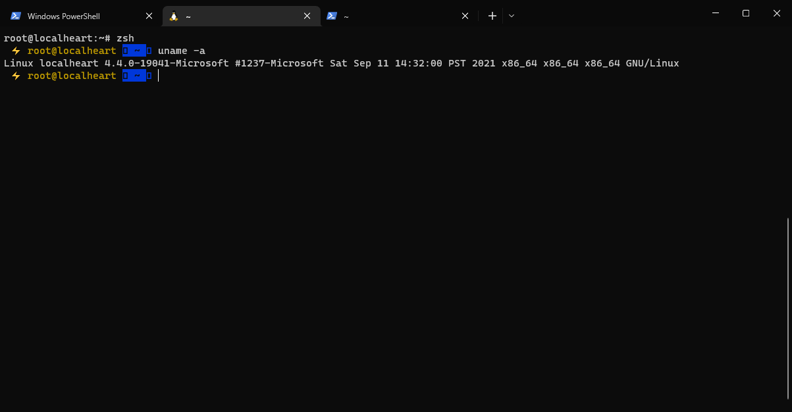

# PRAKTIKUM

Diberikan soal berikut: https://docs.google.com/document/d/1ChXs3UOvgyFuGACv3WtgjZNhTQMogS7CDJTBRdeZgmE/edit#heading=h.a49ok8n034mg

## Problem 1 - Install oh-my-zsh

Setelah mengikuti tutorial di : https://dev.to/mskian/install-z-shell-oh-my-zsh-on-ubuntu-1804-lts-4cm4
Berikut merupakan hasilnya;


## Probelm 2 - Create Automation Script

- Folder utama dengan nama tegar at Wed Jul 3 18:50:22 WIB 2019 merupakan gabungan dari argumen pertama dan command date
```bash
tanggal=`date`
foldername="${1} at ${tanggal}"

mkdir -p "${foldername}/about_me/personal"
mkdir -p "${foldername}/about_me/professional"

mkdir -p "${foldername}/my_friends/"
mkdir -p "${foldername}/my_system_info/"
```

- File facebook.txt dan linkedin.txt berisikan url dengan username masing masing di argumen kedua dan ketiga
```bash
# 2. File facebook.txt dan linkedin.txt berisikan url dengan username masing masing di argumen kedua dan ketiga
echo "https://www.facebook.com/${2}" > "${foldername}/about_me/personal/facebook.txt"
echo "https://www.linkedin.com/in/${3}" > "${foldername}/about_me/professional/linkedin.txt"
```

- File list_of_my_friends.txt berisikan daftar nama teman teman yang diambil menggunakan command curl dari file di bawah.
```bash
# 3. File list_of_my_friends.txt berisikan daftar nama teman teman yang diambil menggunakan command curl dari file di bawah.
# >> Gak jelas soalnya
cat list_of_my_friends.txt > "${foldername}/my_friends/list_of_my_friends.txt"
```

- File about_this_laptop.txt berisikan nama user dan `uname -a` dengan format di bawah
```bash
# 4. File about_this_laptop.txt berisikan nama user dan uname -a dengan format di bawah
username=`id -u -n`
with_host=`uname -a`
echo "My username: ${username}" > "${foldername}/my_system_info/about_this_laptop.txt"
echo "With host: ${with_host}" >> "${foldername}/my_system_info/about_this_laptop.txt"
```

- File internet_connection.txt berisikan hasil keluaran ping ke google.com sebanyak 3 kali.
```bash
# 5. File internet_connection.txt berisikan hasil keluaran ping ke google.com sebanyak 3 kali.
ping google.com -c 3 > "${foldername}/my_system_info/internet_connection.txt"
```