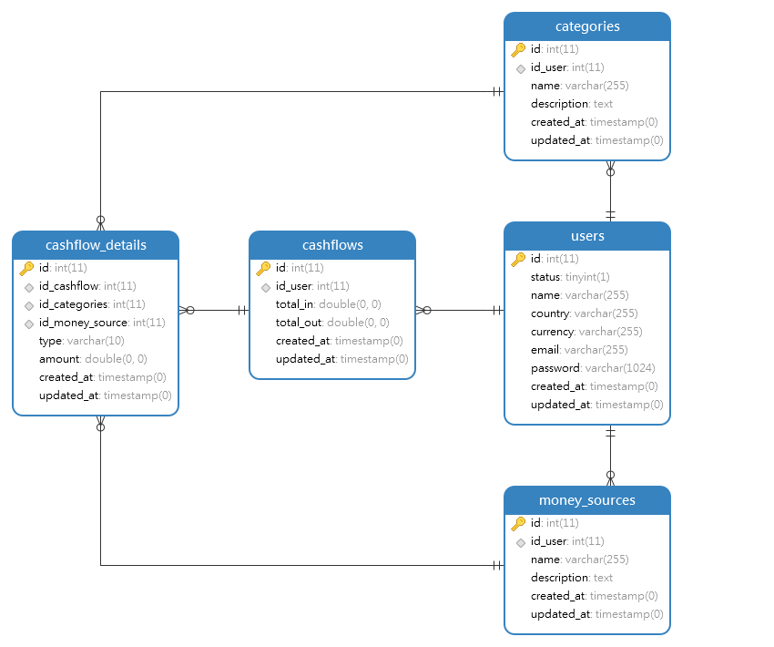

# PRAKTIKUM

Diberikan praktikum sebagai berikut: https://docs.google.com/document/d/1Dil6Y6eVWVBPfaUyJPYaUq9FnjND7sirLXOogqIB6DE/edit#heading=h.u9hu95bg1ivs

## Problem 1 - Diagram
Terdapat sistem pencatatan pengeluaran seseorang dalam jangka waktu harian.

1. Design ERD


2. Use Case Diagram 


## Problem 2 - Query

Membuat query yang memiliki tujuan yang sama dengan perintah sql berikut:
```sql
SELECT * FROM users;
```

1. Redis
```
KEYS *
```
2. Neo4J
```
Match (u:Users) RETURN u
```
3. Cassandra
```
SELECT * FROM users;
```