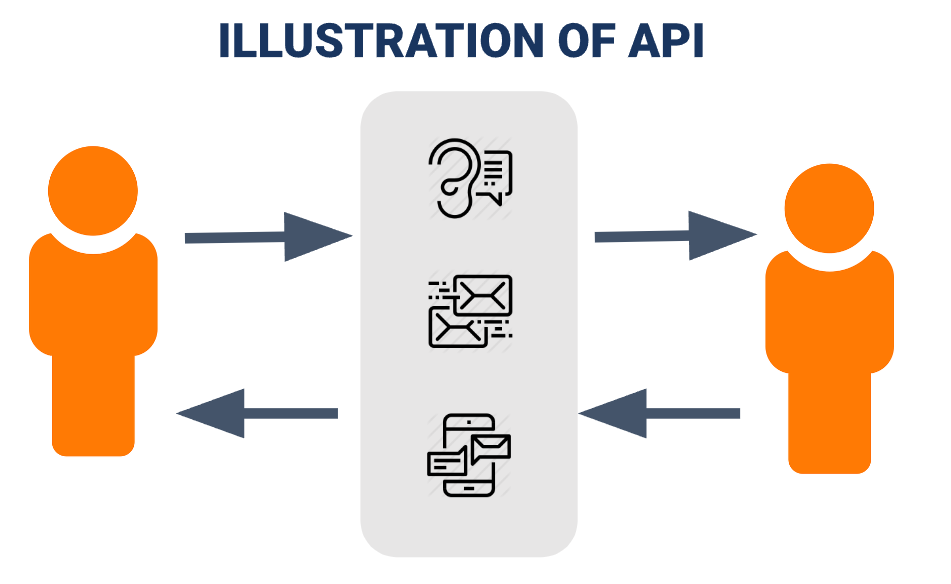

# SUMMARY

## API

API (Application Programming Interface) is a set of functions and procedures allowing the creation of applications that access the featuers or data of an operating system, application, or other service. It is a way for two or more computer programs to communicate with each other. It is a type of software interface, offering a service to other pieces of software.

## REST & JSON

A REST API (also known as RESTful API) is an application programming interface (API or web API) that conforms to the constraints of REST architectural style and allows for interaction with RESTful web services. REST stands for representational state transfer and was created by computer scientist Roy Fielding.

REST API is using HTTP Protocol, with HTTP request Method (GET, POST, PUT, DELETE, HEAD, OPTION, PATCH), and using Request and Response format: JSON, XML, SOAP.

JSON stands for JavaScript Object Notation. JSON is a lightweight format for storing and transporting data. JSON is often used when data is sent from a server to a web page. JSON is "self-describing" and easy to understand

## Difference Type of Request Method and HTTP Response code:

### Difference Type of Request Method
| Method | Description
| - | -|
|GET|	Fetch status line, Response body, Header etc.|
|HEAD|	Same as GET, but only fetch status line and header section|
|POST|	Perform request using request payload mostly in creating a record at the server|
|PUT|	Useful in manipulating/updating the resource using Request payload|
|DELETE|	Deletes information relating to the target resource.|
|OPTIONS|	Describe the communication options for the target resource|
|PATCH|	Very much similar to put but it is more like a minor manipulation|

### HTTP Response Code
| Code | Description | Details |
| - | - | -|
| 200 | OK | Indicates that the request has succeeded. |
| 201 | Created | Indicates that the request has succeeded and a new resource has been created as a result. |
| 400 | Bad Request | The request could not be understood by the server due to incorrect syntax. The client SHOULD NOT repeat the request without modifications. |
| 401 | Unauthorized | Indicates that the request requires user authentication information. The client MAY repeat the request with a suitable Authorization header field. |
| 404 | Not Found | The server can not find the requested resource. | 
| 405 | Method Not Allowed | The request HTTP method is known by the server but has been disabled and cannot be used for that resource. |
| 500 | Internal Server Error | The server encountered an unexpected condition that prevented it from fulfilling the request. |
