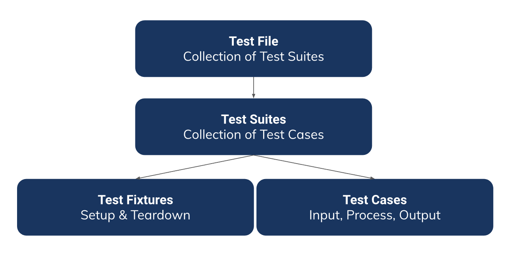

# SUMMARY

## UNIT TESTING IN GOLANG

### 1. Software Testing

Software testing is a process of analyzing a software item to detect the differences between existing and required conditions and to evaluate the features of the software item.

Purpose of testing:
1. Preventing regression
2. Confidence level in refactoring
3. Imporve code design
4. Code documentation
5. Scalling the team

Level of testing:
1. UI
    End to end testing that test the interaction between the overall through the user interface
2. Integration
    Tests a specific modules or sub-system throguh the API
3. Unit
    Test the smallest testable part of an application thorugh methods

### 2. Framework

Framework provides tools, and structure necessary to run **testing efficiently**. In golang, you can use Go Testify.

### 3. Structure

2 Usual pattern:
1. Centralize your test file inside tests folder
2. Save test file together with production file

Structure testing
