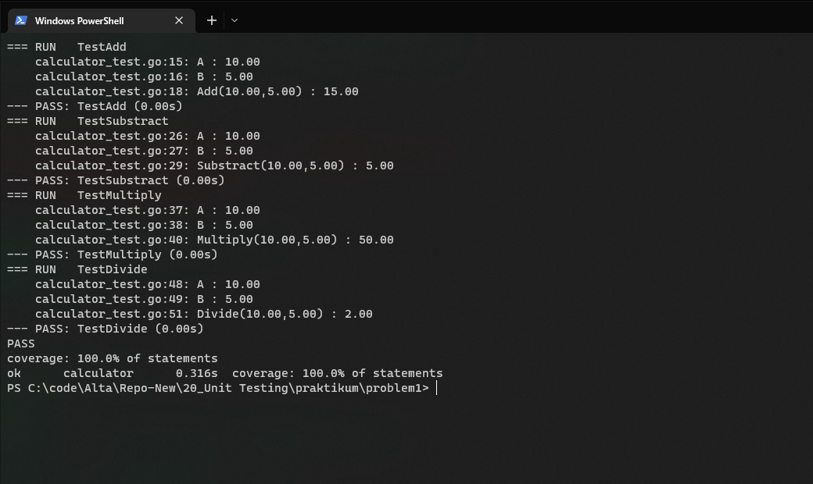

# PRAKTIKUM

Diberikan praktikum pada link berikut: https://docs.google.com/document/d/1EP1TFRQJ6TOiU6g2lqsf9CWr2Qp7eAfLr9O7QSSpP2s/edit

## 1. Simple Test Unit

Kode program dapat dilihat pada [problem1](problem1/)
Dan diperoleh coverage sebesar 100%

Untuk format html coverage dapat dilihat pada : [coverage1.html](coverage1.html)

## 2. Restful API Test Unit

Kode program dapat dilihat pada [problem2](problem2/)
Dan diperoleh coverage sebesar 86.8%

Untuk format html coverage dapat dilihat pada : [coverage2.html](coverage2.html)
