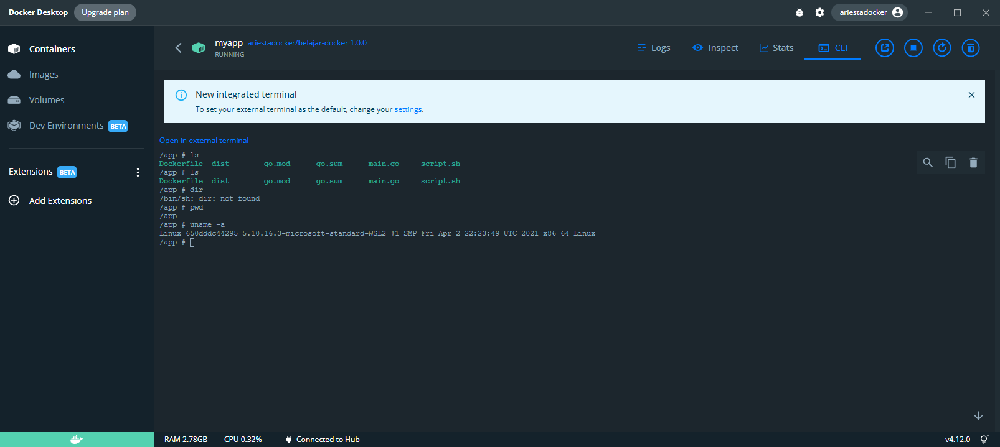

# PRAKTIKUM

Diberikan praktikum pada : https://docs.google.com/presentation/d/e/2PACX-1vQptFwncrcUqZUO-u0Xl65PR0cBKG1Mk8RClBabhJG53CGtJdwrYGipTeuBZvgQ0KFCzu1DoeeujIoB/embed?frameborder=&slide=id.ge7577ca12d_0_13

Tahapan yang dilakukan adalah:

1. Instal Docker Desktop & Migrasi ke WSL 2
2. Menyiapkan file Dockerfile
    ```
    FROM golang:alpine

    WORKDIR /app

    COPY . .

    RUN go mod download
    RUN go build -o dist

    EXPOSE 8000

    ENTRYPOINT [ "./dist" ]
    ```
    Selain itu memasukkan tugas introduction to echo di folder ini
3. Pull images
    ```
    docker pull golang:alphine
    ```
4. Menjalankan script.sh berikut:
    ```sh
    docker build -t $1/belajar-docker:1.0.0 .
    docker run -itd --name myapp -p 8000:8000 $1/belajar-docker:1.0.0
    ```
    dengan `bash script.sh usernamedocker`
    Berikut ss saat sudah running:
    