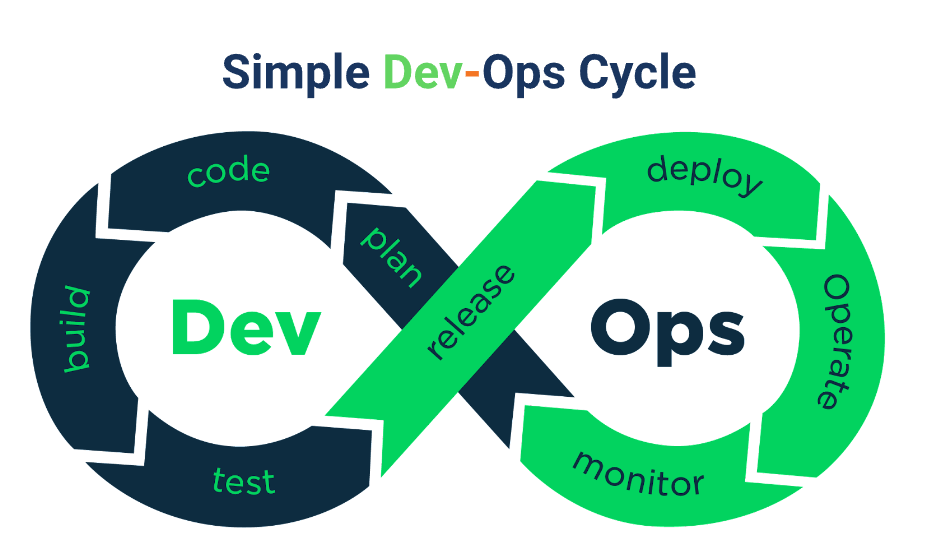
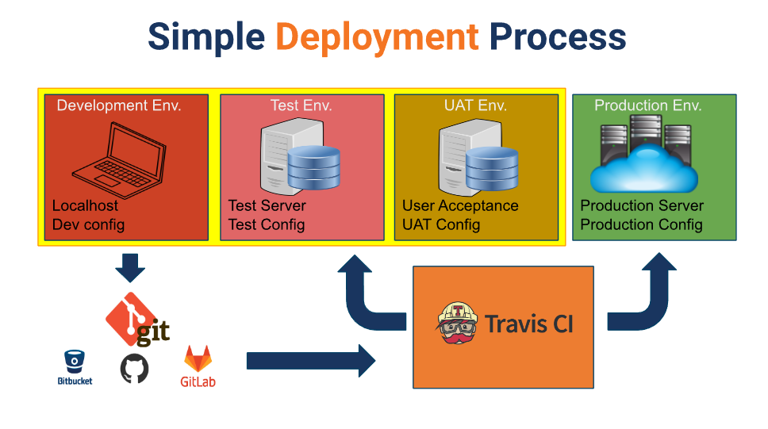

# SUMMARY - Compute Service

## 1. System & Software Deployement

Deployment adalah kegiatan yang bertujuan untuk menyebarkan aplikasi/produk yang telah dikerjakan oleh para pengembang seringkali untuk mengubah dari status **sementara** ke **permanen**. Penyebarannya dapat melalui beragam cara tergantung dari jenis aplikasinya, aplikasi web dan api server sedangkan aplikasi mobile ke Playstore/Appstore.

## 2. Strategi Deployment

1. **Big-Bang Deployment Strategy / Replace Strategy**
    **Kelebihan**:
        - Mudah di implementasikan, klasik tinggal replace
        - Perubahan kepada sistem langsung 100% instant
    **Kekurangan**:
        - Terlalu beresiko, rata-rata downtime cukup lama
2. **Rollout Deploymeny Strategy**
    **Kelebihan**:
        - Lebih aman dan less downtime dari versi sebelumnya
    **Kekurangan**:
        - Akan ada 2 versi aplikasi yg berjalan bersamaan hingga semua server ter-deploy (bisa buat binung)
        - Prosesnya perlahan lahan hingga semua server terkena efek
        - Tidak ada kontrol request.
3. **Blue/Green Deployment Strategy**
    **Kelebihan**:
        - Perubahan sangat cepat
        - Tidak ada issue berbeda versi pada service seperti yang terjadi apda rollout deployment
    **Kekurangan**:
        - Resource yg dibutuhkan lebih banyak karena setiap deployment kita harus menyediakan service yang serupa environmentnya dengan yang sedang berjalan di production.
        - Testing harus benar-benar sangat diprioritaskan sebelum di switch, aplikasi harus kita pastikan aman dari request yang tiba-tiba banyak
4. **Canary Deployment Strategy**
    **Kelebihan**:
        - Cukup aman
        - Mudah untuk rollback jika terjadi error/bug
    **Kekurangan**:
        - Untuk mencapai 100% cukup lama dibandingkan dengan blue/green deployment. Dengan Blue/Green deployement aplikasi langsung 100% terdeploy ke seluruh server

## 3. Simple Dev-Ops Cyle & Process

