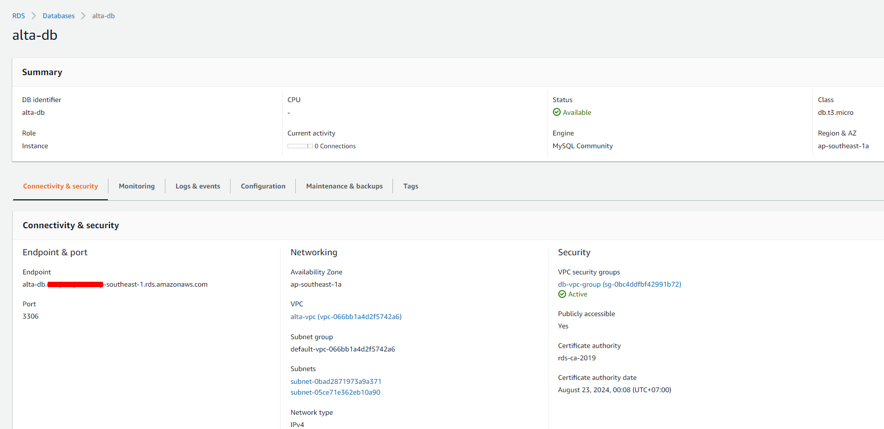
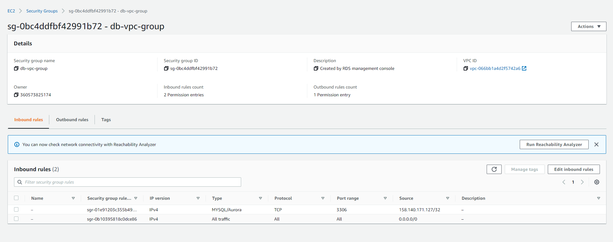
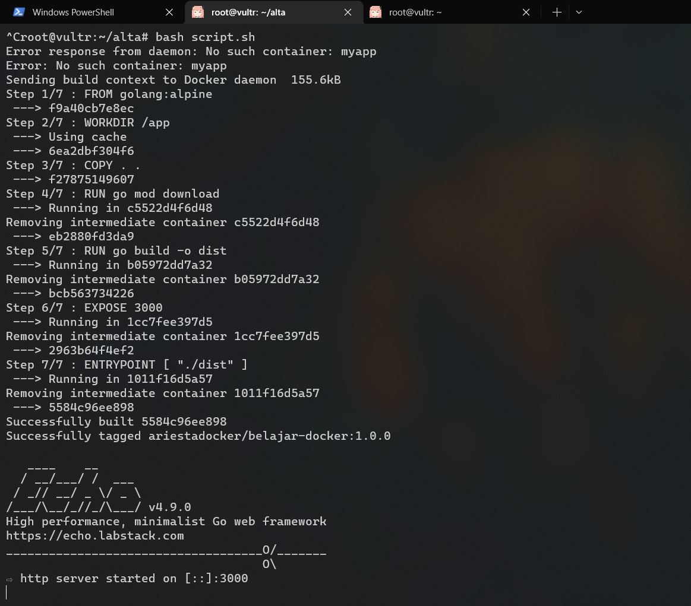
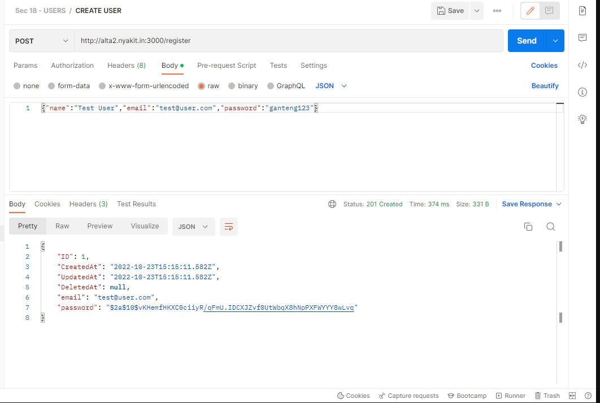
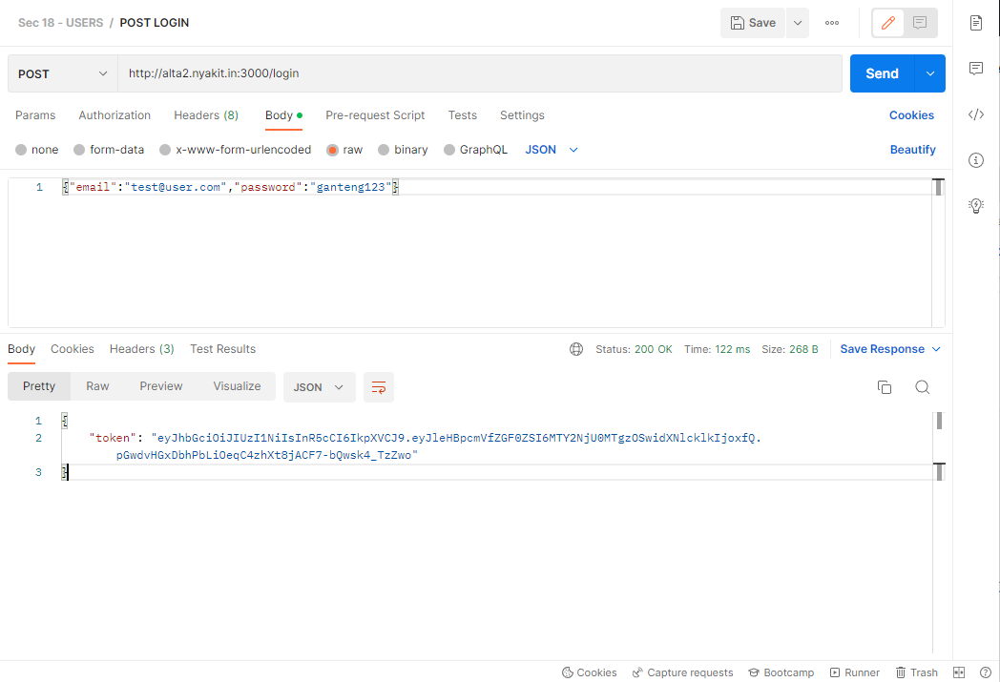
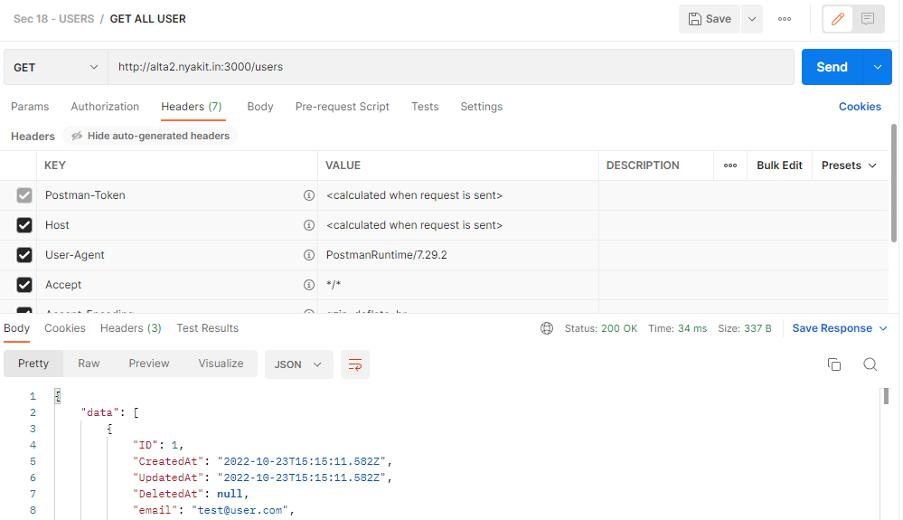

# PRAKTIKUM

[Revisi]
Perbaikan praktikum kali ini deploy diklakukan dengan menggunakan VPS dari AWS.
Deploy dilakukan dengan menggunakan docker dan dengan db menggunakan mysql. Project yang di deploy adalah clean architecture yang sudah dibuat sebelumnya.

Kendala yang ditemukan adalah kesulitan dalam menghubungkan docker dengan RDS MySql di AWS. Namun setelah beberapa kali mencoba, akhirnya diganti dengan membuat RDS dapat diakses secara public.




Kemudian untuk deploy jalankan command berikut
```bash
docker build -t ariestadocker/belajar-docker:1.0.0 .
docker run -v $PWD/.env:/.env -p 3000:3000 ariestadocker/belajar-docker:1.0.0
```

Berikut merupakan hasilnya:



Dan telah dapat dikunjungi secara publik pada domain yang telah di-ALIAS ke IP VPS melalui http://alta2.nyakit.in:3000/. Berikut merupakan hasil tes menggunakan postman



