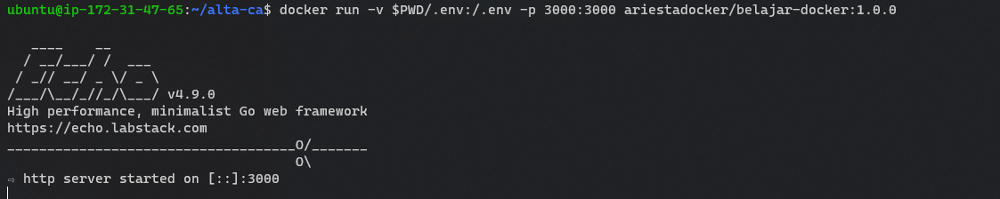

# PRAKTIKUM

Pada praktikum kali ini deploy diklakukan dengana menggunakan VPS dari VULTR.
Deploy dilakukan dengan menggunakan docker dan dengan db menggunakan mysql. Project yang di deploy adalah clean architecture yang sudah dibuat sebelumnya.

Kendala yang ditemukan adalah kesulitan dalam menghubungkan docker dengan mysql. Namun setelah beberapa kali mencoba, akhirnya diganti dengan membuaat port mysql di VPS menjadi terbuka untuk publik untuk digunakan pada docker.
Berikut merupakan port yang saya buka secara public:


Port 3000 merupakan port untuk aplikasi yang di deploy. Dengan menjalankan perintah berikut:
```bash
docker build -t ariestadocker/belajar-docker:1.0.0 .
docker run -v $PWD/.env:/.env -p 3000:3000 ariestadocker/belajar-docker:1.0.0
```

Berikut merupakan hasilnya:



Dan telah dapat dikunjungi secara publik pada domain yang telah di-ALIAS ke IP VPS melalui http://alta.nyakit.in:3000/.

