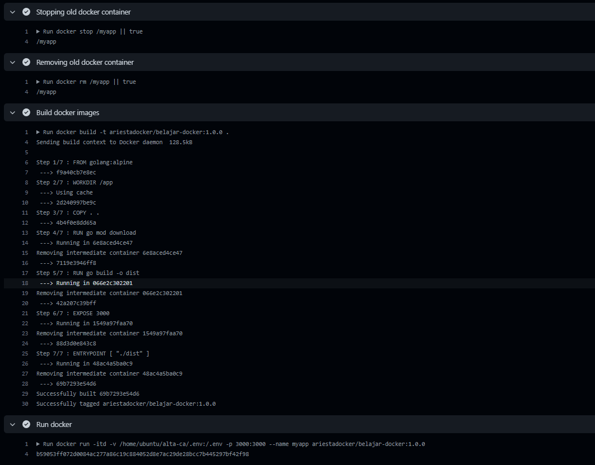
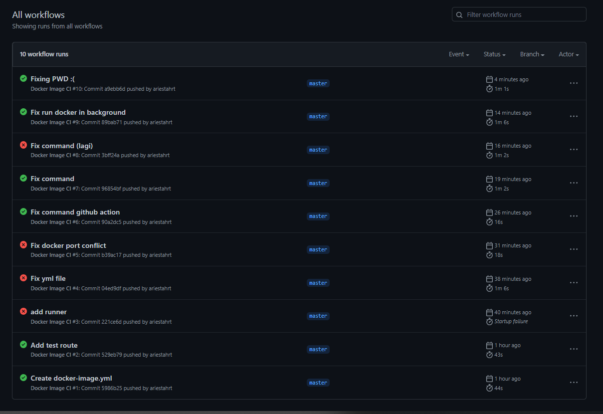
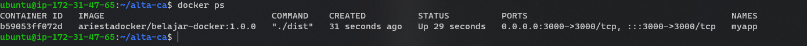

# PRAKTIKUM

Repository yang saya gunakan untuk CI/CD adalah berikut: https://github.com/ariestahrt/alta-ca/

Berikut merupakan workflows untuk docker-image.yml:
```
name: Docker Image CI

on:
  push:
    branches: [ "master" ]
  pull_request:
    branches: [ "master" ]

jobs:

  build:

    runs-on: self-hosted

    steps:
    - uses: actions/checkout@v3
    - name: Stopping old docker container
      run: docker stop /myapp || true
    - name: Removing old docker container
      run: docker rm /myapp || true
    - name: Build docker images
      run: docker build -t ariestadocker/belajar-docker:1.0.0 .
    - name: Run docker
      run: docker run -itd -v /home/ubuntu/alta-ca/.env:/.env -p 3000:3000 --name myapp ariestadocker/belajar-docker:1.0.0
   
```

Setelah sekian kalinya mencoba, akhirnya saya berhasil membuat CI/CD dengan menggunakan github actions. Berikut merupakan hasil logsnya:




Berikut docker telah berjalan:

