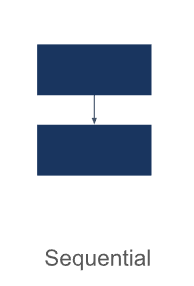
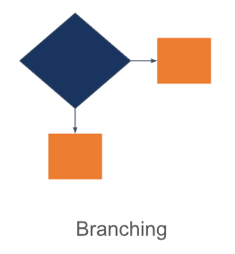
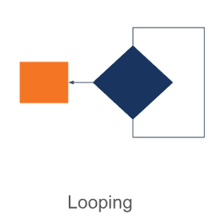

# Summary 


## Algoritma

Argoritma adalah prosedur komputasi yang didefinisikan dengan baik yang mengambil beberapa nilai sebagai input dan menghasilkan beberapa nilai sebagai output. Algoritma memiliki karakteristik sebagai berikut:

1. Memiliki batas awal dan akhir
2. Instruksi terdefinisi dengan baik
3. Efektif dan efisien

Adapun algoritma dasar adalah sebagai berikut:

1. Sequential


2. Branching / Percabangan


3. Looping / Perulangan


## Pseudocode

Salah satu cara dalam menuliskan algoritma dapat melalui pseudocode. Pseudocode adalah deskripsi bahasa sederhana yang digunakan untuk menuangkan sebuah ide algoritma itu sendiri. Berikut merupakan contoh pseudo code menghitung luas segitiga:

```
INPUT Alas dan Tinggi
CALCULATE Luas = (Alas * Tinggi) / 2
PRINT Luas
```

## Flowchart

Salah satu cara lain dalam menuliskan algoritma dapat melalui Flowchart. Flowchart adalah suatu bagan dengan simbol tertentu yang menggambarkan urutan dan hubungan antar proses secara mendetail.

### Simbol Flowchart
| Gambar | Fungsi |
|--|--|
|  | Mulai / Selesai |
|  | Proses |
|  | Input / Output |
|  | Perkondisian |
|  | Looping |
