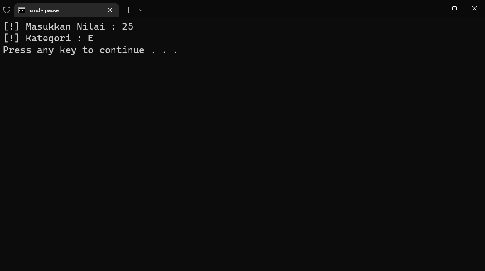
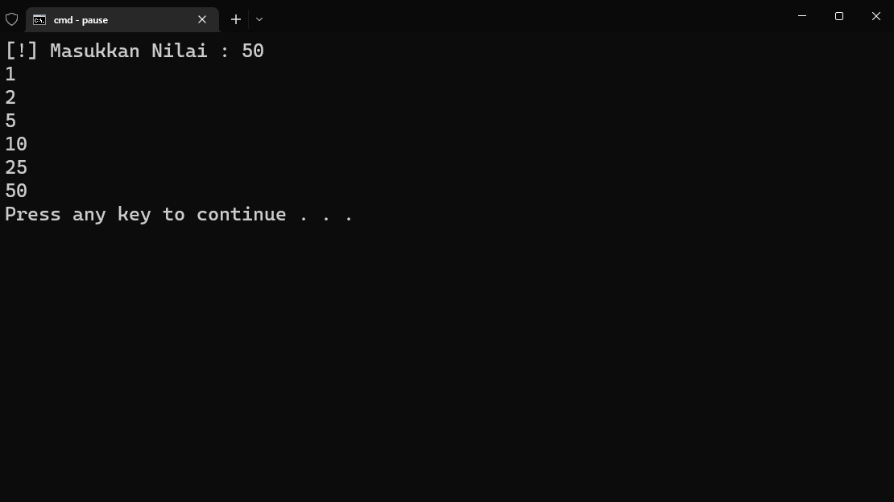
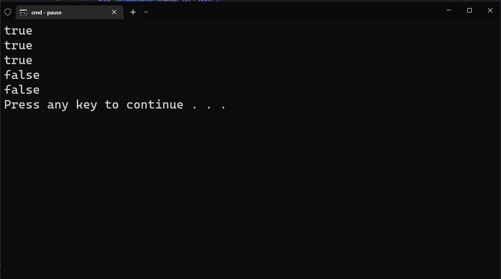
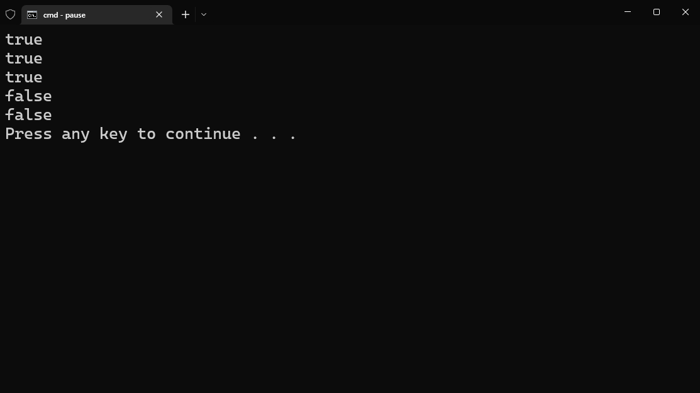
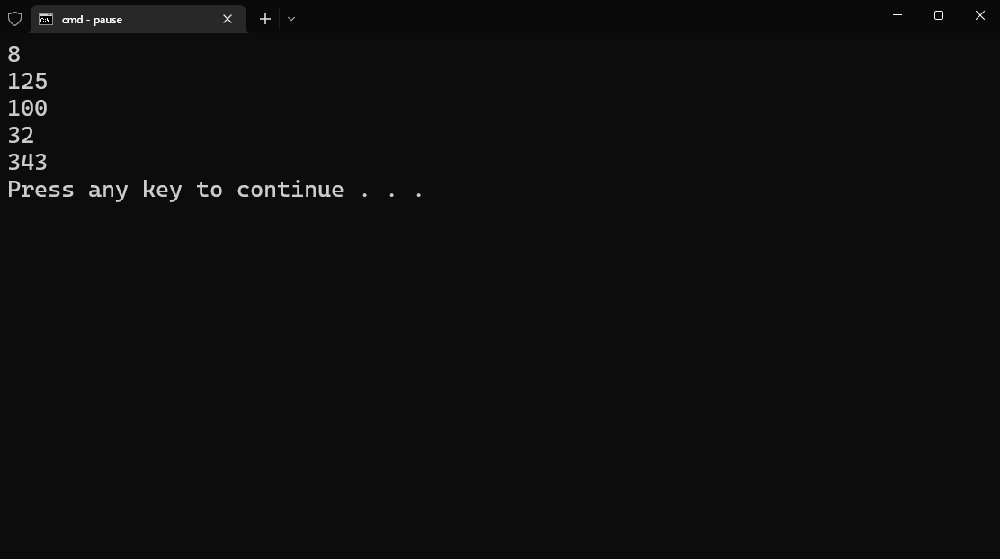
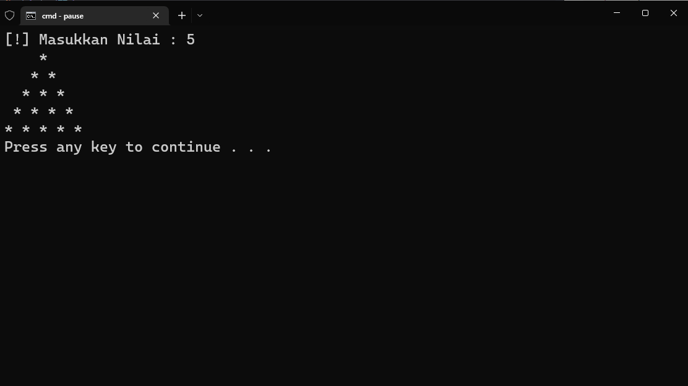
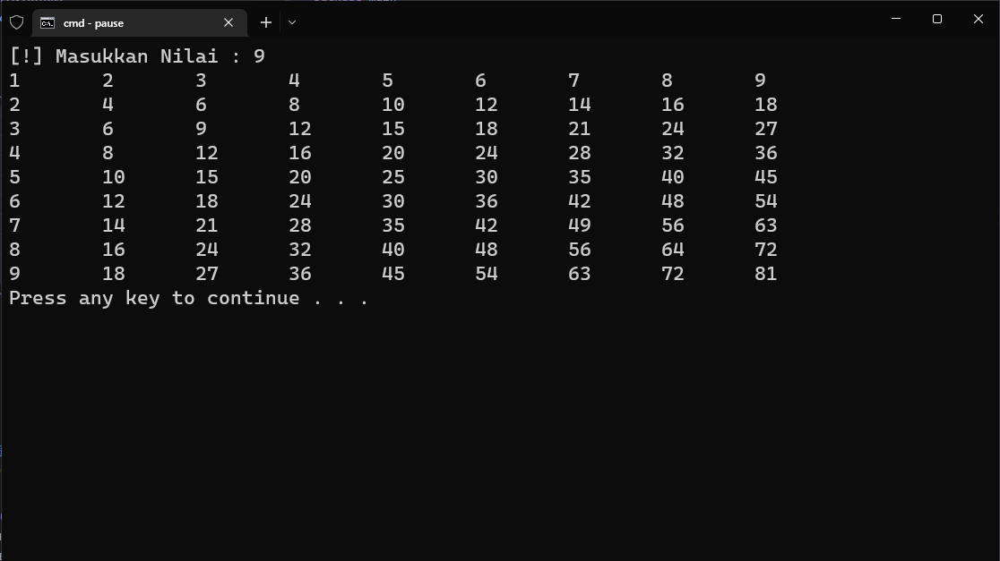

# Praktikum

Diberikan soal latihan pada link berikut : https://docs.google.com/document/d/1Rl6mJaG05q5XMSUVOjPOwdZxcwkYWqrJxw4L1VZALCc/edit

## Solusi

### [Problem-1](problem-1.go)
Kode Program
```go
package main

import (
	"fmt"
	"math"
)

func main(){
	var T float32
	var r float32

	fmt.Print("[!] Masukkan T : ")
	fmt.Scanf("%f\n", &T)
	fmt.Print("[!] Masukkan r : ")
	fmt.Scanf("%f\n", &r)
	
	// Kode
	Lp := 2 * math.Pi * r * (r + T)
	fmt.Printf("[!] Luas : %.2f\n", Lp)
}
```
Output


### [Problem-2](problem-2.go)
Kode Program
```go
package main

import (
	"fmt"
)

func main() {
	var studentScore int = 80
	fmt.Print("[!] Masukkan Nilai : ")
	fmt.Scanf("%d\n", &studentScore)
	fmt.Print("[!] Kategori : ")

	if studentScore > 100 {
		fmt.Println("Nilai Invalid")
	} else if studentScore >= 80 {
		fmt.Println("A")
	} else if studentScore >= 65 {
		fmt.Println("B")
	} else if studentScore >= 50 {
		fmt.Println("C")
	} else if studentScore >= 35 {
		fmt.Println("D")
	} else if studentScore >= 0 {
		fmt.Println("E")
	} else {
		fmt.Println("Nilai Invalid")
	}

}
```
Output


### [Problem-3](problem-3.go)
Kode Program
```go
package main

import (
	"fmt"
)

func main() {
	var N int
	fmt.Print("[!] Masukkan Nilai : ")
	fmt.Scanf("%d\n", &N)
	
	for i := 1; i <= N; i++ {
		if N % i == 0 {
			fmt.Printf("%d\n", i)
		}
	}
}
```
Output


### [Problem-4](problem-4.go)
Kode Program
```go
package main

import (
	"fmt"
	"math"
)

func primeNumber(number int) bool {
	if number < 2 { return false }

	for i := 2; i<= int(math.Sqrt(float64(number))); i++ {
		if number % i == 0 {
			return false
		} 
	}
	return true
}

func main() {
	fmt.Println(primeNumber(11))
	fmt.Println(primeNumber(13))
	fmt.Println(primeNumber(17))
	fmt.Println(primeNumber(20))
	fmt.Println(primeNumber(35))
}
```
Output


### [Problem-5](problem-5.go)
Kode Program
```go
package main

import (
	"fmt"
)

func palindrome(input string) bool {
	for i := 0; i<len(input) / 2; i++ {
		if input[i] != input[len(input)-1-i] {
			return false
		}
	}

	return true
}

func main() {
	fmt.Println(palindrome("civic"))
	fmt.Println(palindrome("katak"))
	fmt.Println(palindrome("kasur rusak"))
	fmt.Println(palindrome("mistar"))
	fmt.Println(palindrome("lion"))
}
```
Output


### [Problem-6](problem-6.go)
Kode Program
```go
package main

import (
	"fmt"
)

func Pangkat(base int, pangkat int) int {
	if pangkat == 0 { return 1 }
	return base * Pangkat(base, pangkat-1)
}

func main() {
	fmt.Println(Pangkat(2,3))
	fmt.Println(Pangkat(5,3))
	fmt.Println(Pangkat(10,2))
	fmt.Println(Pangkat(2,5))
	fmt.Println(Pangkat(7,3))
}
```
Output


### [Problem-7](problem-7.go)
Kode Program
```go
package main

import (
	"fmt"
)

func playWithAsterik(n int) {
	for i := 1; i <= n; i++ {
		for j := 0; j < n-i; j++ {
			fmt.Print(" ")
		}
		for j := 0; j < i; j++ {
			fmt.Print("* ")
		}
		fmt.Print("\n")
	}
}

func main() {
	var n int = 5
	fmt.Print("[!] Masukkan Nilai : ")
	fmt.Scanf("%d\n", &n)
	playWithAsterik(n)
}
```
Output


### [Problem-8](problem-8.go)
Kode Program
```go
package main

import (
	"fmt"
)

func cetakTablePerkalian(n int) {
	for i := 1; i <= n; i++ {
		for j := 1; j <= n; j++ {
			fmt.Printf("%d\t", i * j)
		}
		fmt.Println()
	}
}

func main() {
	var n int = 9
	fmt.Print("[!] Masukkan Nilai : ")
	fmt.Scanf("%d\n", &n)
	cetakTablePerkalian(n)
}
```
Output


