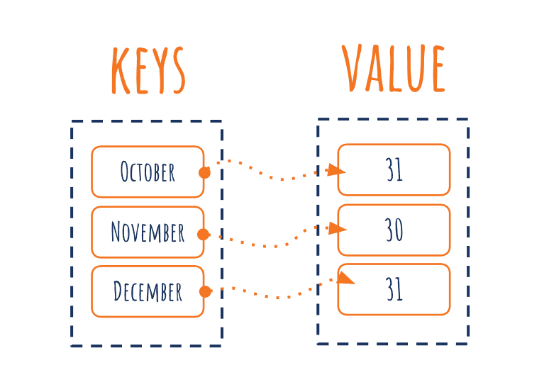

# Summary

## 1. Array

Array adalah struktur data yang terdiri dari kumpulan elemen dengan tipe data yang sama. Array memiliki kapasitas tetap yang ditentukan saat pembuatan (inisiasi). Default value pada array adalah zero value dari element. Berikut merupakan contoh penerapan array

```go
var names [4]string
names[0] = "kadek"
names[1] = "agus"
names[2] = "ariesta"
names[3] = "putra"

fmt.Println(names[0], names[1], names[2], names[3])

// inisiasi juga dapat dengan syntax berikut
var fruits = [4]string{"apple", "grape", "banana", "melon"}

// inisiasi juga dapat dengan tanpa menentukan jumlah sebagai berikut
var fruits2 = [...]string{"apple", "grape", "banana", "melon"}

// untuk multidimensi
var numbers = [2][3]int{{3, 2, 3}, {3, 4, 5}}
```

## 2. Slice

Sama halnya seperti array, namun slice memiliki kapasitas dinamis artinya dapat berubah-ubah. Slice merupakan reference elemen array sehingga mengubah di tiap elemen slice akan berdampak pada slice lain yang memiliki alamat memori yang sama. Berikut merupakan contoh penggunaan slice

```go
// inisiasi
var fruits = []string{"apple", "grape", "banana", "melon"}
// dapat juga dengan make
sometings := make([]string, 10)

// Contoh penggunaan slice
var newFruits = fruits[0:2]
fmt.Println(newFruits) // ["apple", "grape"]
```

Adapun fungsi yang tersedia pada slice adalah

1. append()
untuk menambahkan elemen pada slice
```go
var fruits = []string{"apple", "grape", "banana", "melon"}
fruits = append(fruits, "cherry")
```
2. copy()
untuk menduplikat slice
```go
var fruits = []string{"apple", "grape", "banana", "melon"}
fruits_copy := make([]string, 3)
copy(fruits_copy, fruits)
fmt.Println(fruits_copy) // [apple grape banana]
```
3. cap()
Digunakan untuk menghitung lebar atau kapasitas maksimum slice
4. len()
Digunakan untuk menghitung jumlah elemen slice yang ada

## 3. Map
Map adalah data struktur yang menyimpan data dalam bentuk pasangan (key => value) dengan setiap key adalah unik. Berikut merupakan ilustrasi dari penerapan key => value untuk kasus tanggal terakhir pada setiap bulan dengan bulan sebagai key.



Berikut merupakan syntax dari map:

```go
// inisiasi
var flag = map[string]bool{}
flag["Ariesta"] = true

var level = map[string]int{"ariesta": 50, "anisa": 21}
```