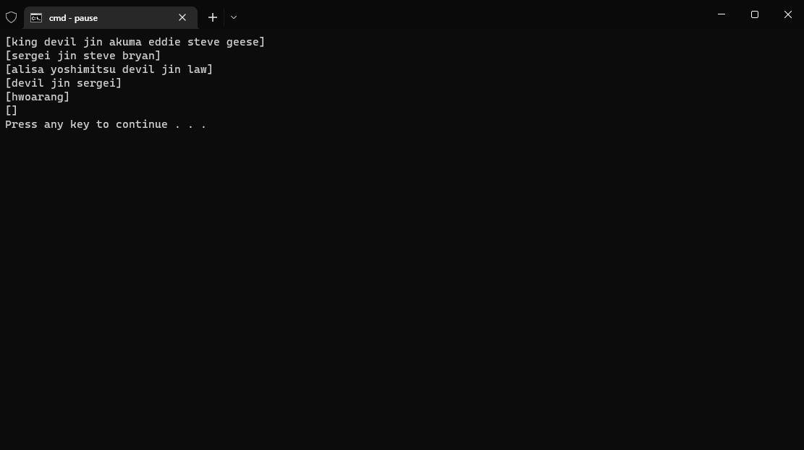
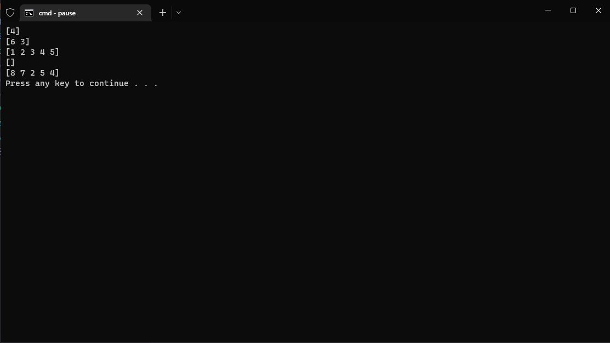

# PRAKTIKUM

Diberikan soal praktikum berikut : https://docs.google.com/document/d/1B21O1UZOl6rdTU3POze-gCnfazbt6tq2P7851GQHxTY/preview

## Problem-1 | Array Merge

Solusi : [problem-1.go](problem-1.go)
Output :

## Problem-2 | Angka Muncul Sekali

Solusi : [problem-2.go](problem-2.go)
Output :

## Problem-3 | Pair with Target Sum

Solusi : [problem-3.go](problem-3.go)
Output :
