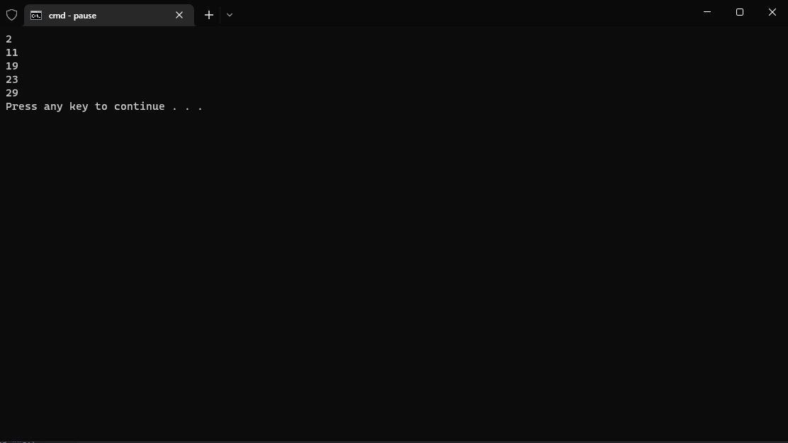
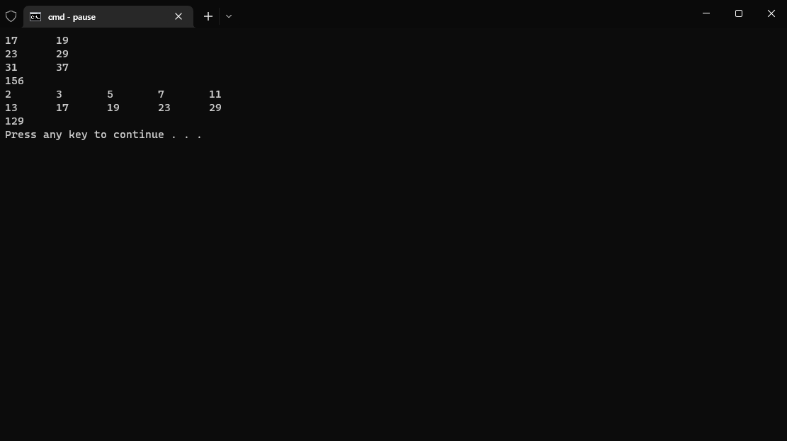
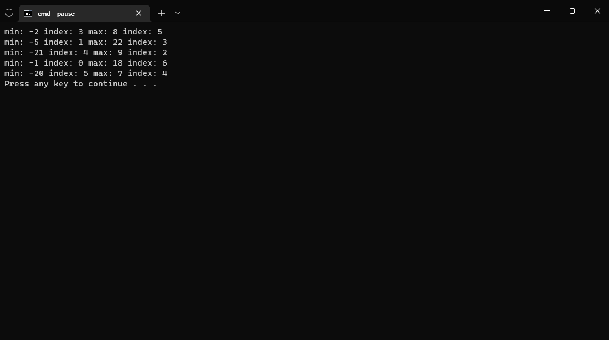
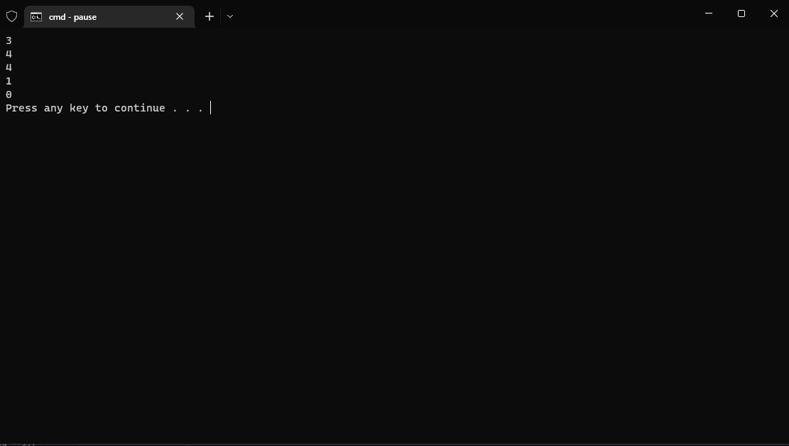
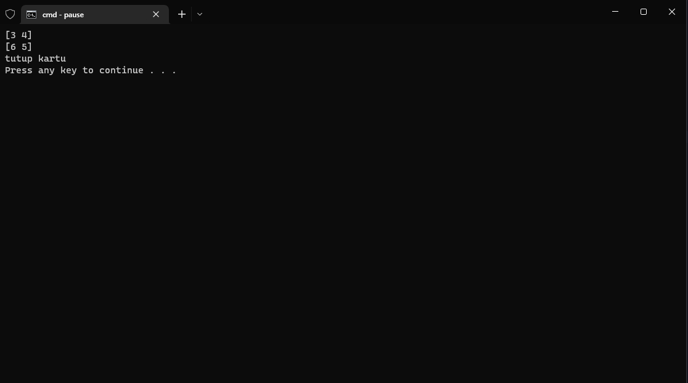
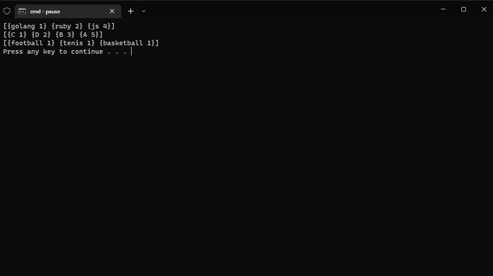

# PRAKTIKUM

Diberikan soal praktikum berikut : https://docs.google.com/document/d/1U7vnXRUG7Lk4qd3zrK0b-fpOTGGbJCuuPmB7OcoJrQw/preview

## Problem-1 | Prima ke X

Solusi : [problem-1.go](problem-1.go)
Output :

## Problem-2 | Fibonacci (Recursive)

Solusi : [problem-2.go](problem-2.go)
Output :

## Problem-3 | Prisma segi empat

Solusi : [problem-3.go](problem-3.go)
Output :

## Problem-4 | Total Maksimum Dari Deret Bilangan

Solusi : [problem-4.go](problem-4.go)
Output :

## Problem-5 | Find Min and Max Number

Solusi : [problem-5.go](problem-5.go)
Output :

## Problem-6 | Maximum Buy Product

Solusi : [problem-6.go](problem-6.go)
Output :

## Problem-7 | Playing Domino

Solusi : [problem-7.go](problem-7.go)
Output :

## Problem-8 | Most Appear Item

Solusi : [problem-8.go](problem-8.go)
Output :

