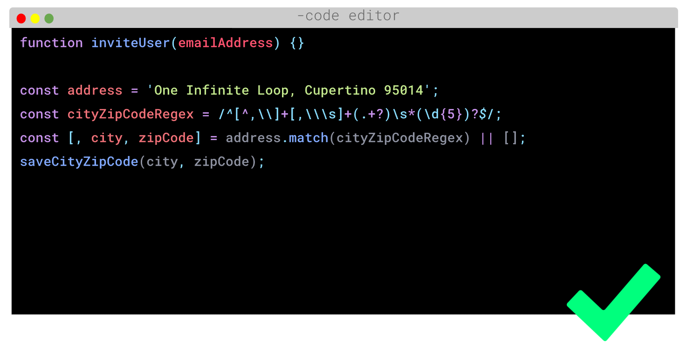

# Summary

## 1. Mengapa Harus "Clean Code"

`Clean Code` adalah istilah untuk kode yang mudah dibaca dipahami dan diubah oleh programmer. Programmer yang baik dapat menulis kode yang dapat dimengerti oleh manusia. Kenapa harus `Clean Code`? Clean code akan bermanfaat untuk:

1. Work Collaboration
2. Feature Development
3. Faster Development

## 2. Karakteristik "Clean Code"

Terdapat 9 karakteristik dalam clean code sebagai berikut:

1. Mudah dipahami
Kode harus memiliki penamaan yang mudah dipahami
2. Mudah dieja dan dicari
Contohnya adalah penamaan variabel dapat menggunakan gaya penulisan camelCase atau snake_case agar lebih mudah untuk dieja dan dicari
3. Singkat namun mendeskripsikan konteks
DONT

DO

4. Konsisten

Konsisten disini adalah gaya penulisan variabel harus konsisten tidak boleh berubah-ubah.
DONT:
```go
const DAY_IN_WEEK = 8;
const dayInMonth = 30;
```
DO:
```go
const DAY_IN_WEEK = 8;
const DAY_IN_MONTH = 30;
```
5. Hindari penambahan konteks yang tidak perlu
DONT:
```go
type car struct {
    carModel int
    carColor string
}
```
DO:
```go
type car struct {
    model int
    color string
}
```
6. Komentar
Berikan komentar hanya pada kode program yang memiliki alur yang spesifik.
7. Good function
Fungsi yang bagus tidak memiliki banyak argument
8. Gunakan konvensi
Gunakan style guide dari acuan yang diberikan perusahaan
9. Formatting
Saran formating sebagai berikut:
- Lebar baris code 80 - 120 karakter
- Satu clas 300 - 500 baris
- Baris kode yang berhubungan saling berdekatan
- Perhatikan indentasi

## 3. Prinsip "Clean Code"

1. KISS - Keep It So Simple

Hindari membuat fungsi yang dibuat untuk melakukan A sekaligus meomodifikasi B, lalu mengecek fungsi C, dst. Fungsi di setiap class dibuat untuk melakukan satu tugas saja, jangan gunakan terlalu banyak argument.

2. DRY - Don't Repeat Yourself

Duplikasi kode terjadi karena sering copy paste. Untuk menghindari duplikasi code buatlah fungsi yang dapat digunakan secara berulang-ulang.

3. REFACTORING

Refactoring adalah proses restrukturisasi kode yang dibuat, dengan cara mengubah struktur internal tanpa mengubah perilaku eksternal. Prinsip KISS dan DRY bisa dicapai dengan cara refactor.