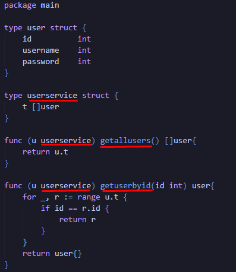

# PRAKTIKUM

Diberikan soal sebagai berikut: https://docs.google.com/document/d/1KLAKKe6OZuQrRjJPlPgT7fj9U44-NWdBPnbBmRP_nbY/edit

# Problem 1 - Analysis

Diberika kode awal sebagai berikut:

```go
package main

type user struct {
	id int
	username int
	password int
}

type userservice struct {
	t []user
}

func (u userservice) getallusers() []user{
	return u.t
}

func (u userservice) getuserbyid(id int) user{
	for _, r := range u.t {
		if id == r.id {
			return r
		}
	}
	return user{}
}
```

Tentukan berapa banyak kekurangan dalam penulisan kdoe tersebut?
Bagian mana saja terjadi kekurangan tersebut? dan tulisakan alasannya.

Berdasarkan 9 karakteristik "Clean Code", adapun kekurangan dalam penulisan kode tersebut terdapat pada bagian-bagian berikut:

1. Mudah Dipahami

Permasalahan terdapat pada bagian:
```go
type userservice struct {
	t []user // << ====
}

...

func (u userservice) getuserbyid(id int) user{
	for _, r := range u.t { // << ====
		if id == r.id {
			return r
		}
	}
	return user{}
}
```
Tidak mudah dipahami maksud dari variabel `t` dan `r` 

2. Mudah dieja dan dicari

Permasalahan terdapat pada penulisan variabel-variabel tidak menggunakan salah satu gaya penulisan variabel yaitu camelCase atau snake_case. Sebagai contoh penulisan type `userservice` harusnya menjadi `userService` jika menggunakan gaya camelCase agar mudah untuk dieja dan dicari. Adapun variabel bermasalah adalah pada screenshot berikut:



Menurut saya apabila 2 permasalahan di atas dapat terselesaikan, seharusnya kode program sudah dapat dengan mudah dipahami sehingga tidak perlu menyisipkan komentar. Adapun kode program setelah diperbaiki adalah sebagai berikut:

```go
package main

type user struct {
	id int
	username int
	password int
}

type userService struct {
	userList []user
}

func (usr userService) getAllUsers() []user{
	return usr.userList
}

func (usr userService) getUserById(id int) user{
	for _, currentUser := range usr.userList {
		if id == currentUser.id {
			return currentUser
		}
	}
	return user{}
}
```

# Problem 2 - Rewrite

Kode program setelah dilakukan penulisan ulang dengan memperhatikan kaidah "Clean Code" adalah sebagai berikut: [problem-2.go](problem-2.go)

```go
package main

type kendaraan struct {
	totalRoda int
	kecepatanPerJam int
}

type mobil struct {
	kendaraan
}

func (m *mobil) berjalan() {
	m.tambahKecepatan(10)
}

func (m *mobil) tambahKecepatan(kecepatanBaru int) {
	m.kecepatanPerJam += kecepatanBaru
}

func main() {
	mobilCepat := mobil{}
	mobilCepat.berjalan()
	mobilCepat.berjalan()
	mobilCepat.berjalan()

	mobilLamban := mobil{}
	mobilLamban.berjalan()
}
```
