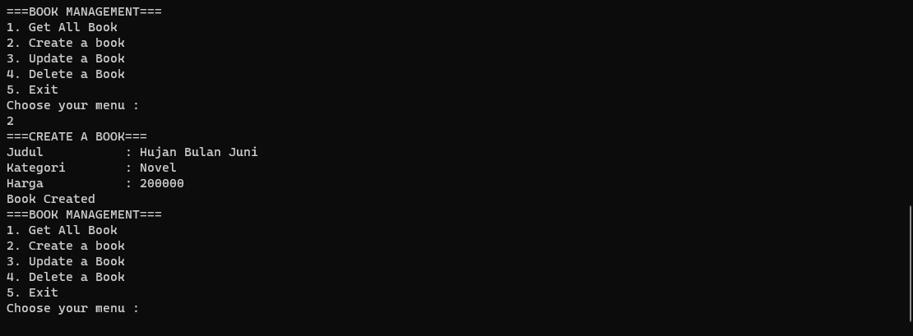
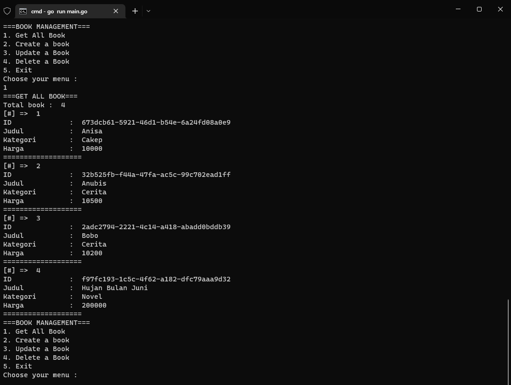
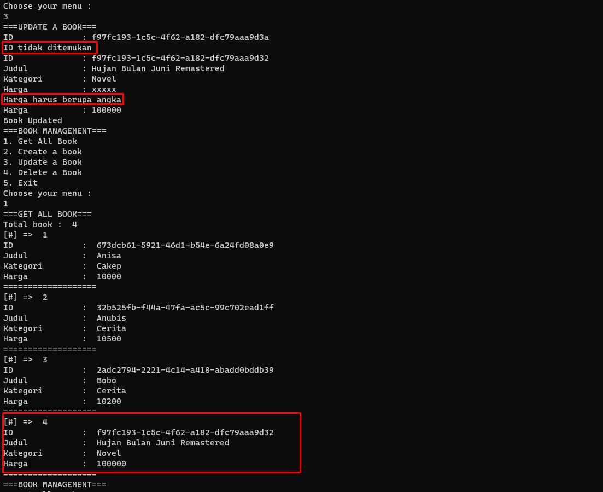
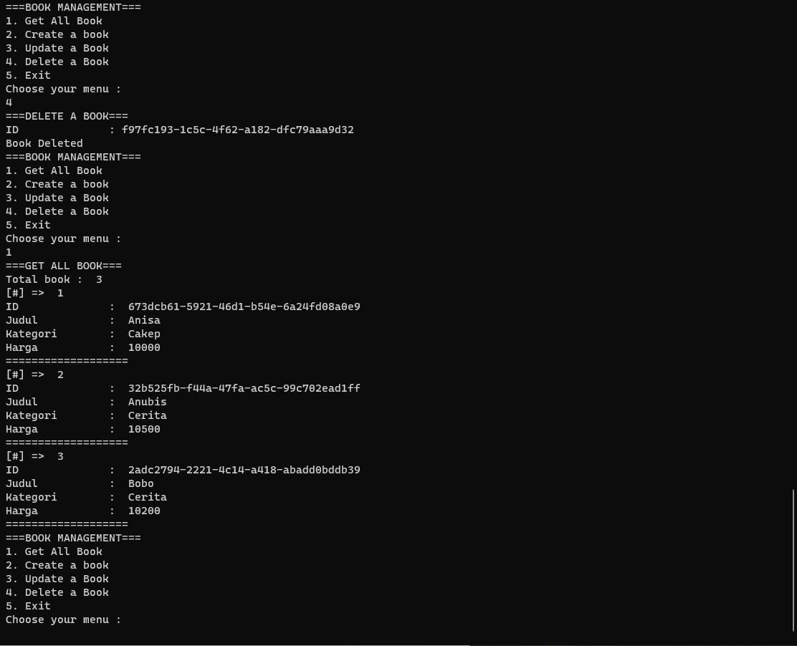
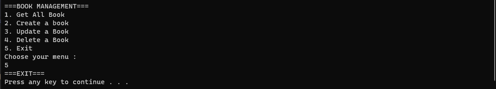

# WEEKLY 1

Diberikan tugas weekly 1 sebagai berikut: https://docs.google.com/document/d/1kN9YgAchRHaRJTvZmqmwMiV8WrcS7ODdBLs5cSMX8WE/edit

# Dokumentasi

Adapun source code terdapat pada [main.go](main.go). Berikut merupakan dokumentasi dari setiap fungsi:

## Menambahkan Data Buku

## Menampilkan Data Buku

Sudah diurutkan A-Z berdasarkan judul buku.

## Mengupdate Data Buku

Terdapat validasi ID buku yang akan diupdate. Jika ID buku tidak ditemukan, maka akan menampilkan pesan error. Terdapat pula validasi harga buku, jika harga buku tidak sesuai (bukan unsigned integer) atau < 0 , maka akan menampilkan pesan error.

## Menghapus Data Buku

Terdapat validasi ID buku yang akan dihapus. Jika ID buku tidak ditemukan, maka akan menampilkan pesan error.

## Keluar Aplikasi

